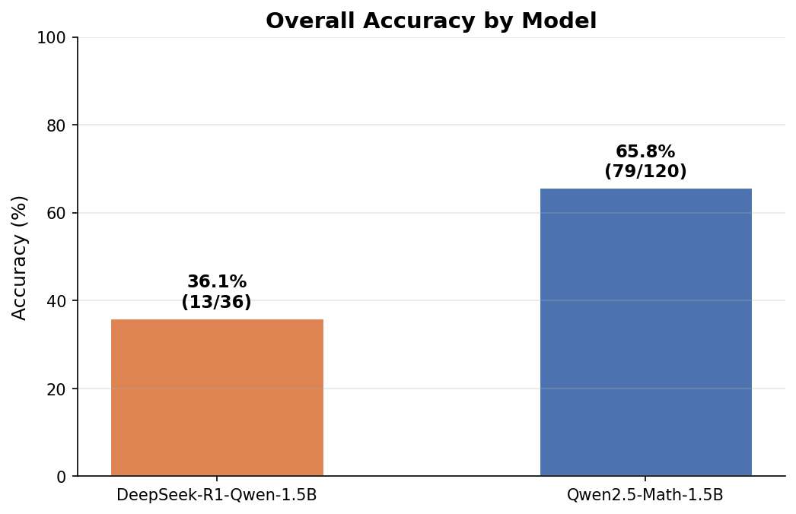
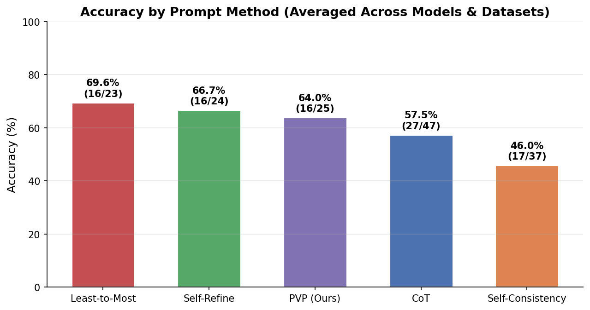
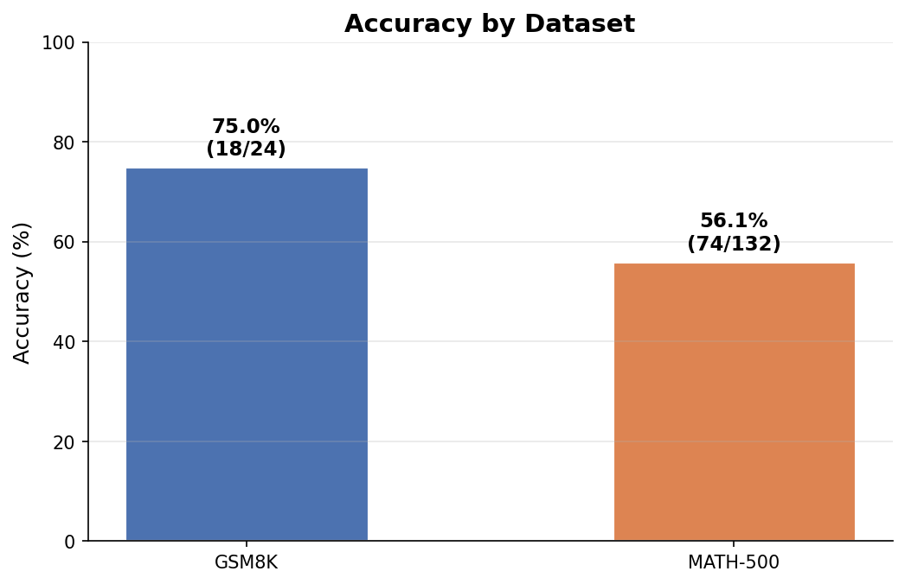
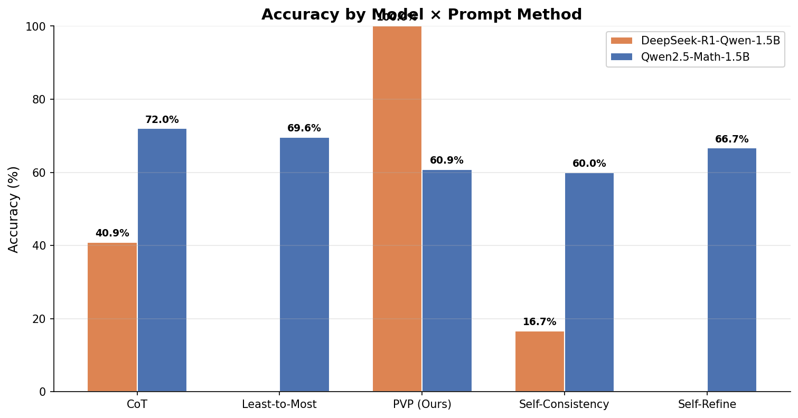
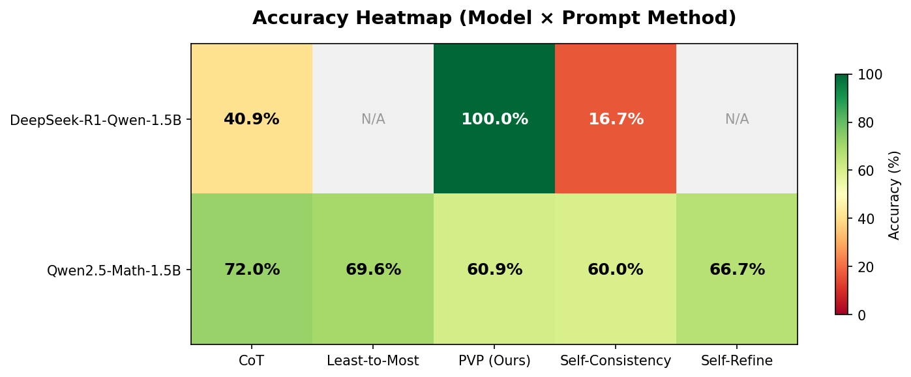
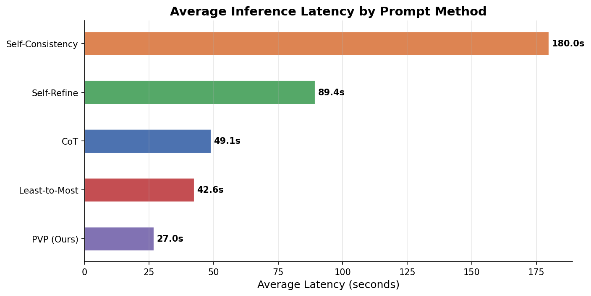
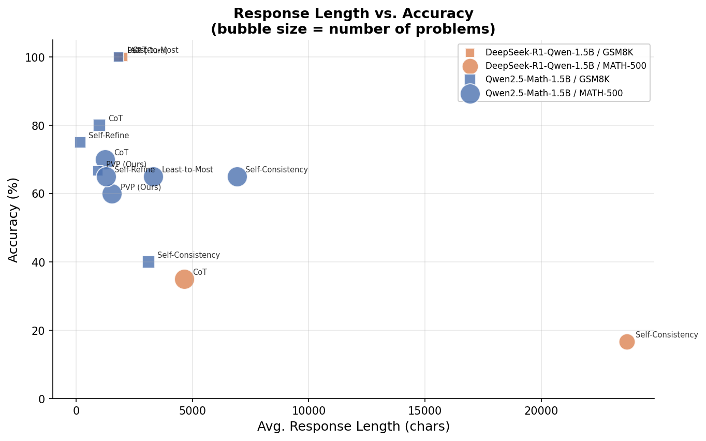

# Experiment Results — Mathematical Reasoning in LLMs

> **Project**: CS6493 NLP Group Project — Topic 1: Mathematical Reasoning Ability of LLMs
> **Date**: April 2026
> **Overall Accuracy**: **58.97%** (92/156 problems)

---

## 1. Experiment Setup

### Models

| Model | Parameters | Format | Quantization |
|-------|-----------|--------|-------------|
| **Qwen2.5-Math-1.5B** | 1.5B | GGUF | Q4_K_M |
| **DeepSeek-R1-Distill-Qwen-1.5B** | 1.5B | GGUF | Q4_K_M |

### Prompt Methods

| Method | Key Idea | Multi-Call |
|--------|----------|-----------|
| **Chain-of-Thought (CoT)** | Step-by-step reasoning | No |
| **Self-Consistency (SC)** | Multiple samples + majority vote | Yes (n=5) |
| **Self-Refine** | Self-critique → refinement loop | Yes (max 2 rounds) |
| **Least-to-Most** | Decompose → solve sub-problems | Yes (2 calls) |
| **PVP (Ours)** | Progressive verification at each step | No |

### Datasets

| Dataset | Size | Difficulty | Problems Used |
|---------|------|-----------|--------------|
| **MATH-500** | 500 | Competition-level | 20 |
| **GSM8K** | 1,319 | Grade school | 2–5 |
| **AIME 2024** | 30 | Advanced competition | — |

### Configuration

- **Temperature**: 0.0 (deterministic, except SC which uses sampling)
- **Max tokens**: 2,048
- **Random seed**: 42
- **Self-Consistency samples**: 5
- **Self-Refine max rounds**: 2

---

## 2. Overall Results

### 2.1 Accuracy by Model

| Model | Correct | Total | Accuracy |
|-------|---------|-------|----------|
| **Qwen2.5-Math-1.5B** | 79 | 120 | **65.83%** |
| **DeepSeek-R1-Qwen-1.5B** | 13 | 36 | **36.11%** |
| **Overall** | **92** | **156** | **58.97%** |

Qwen2.5-Math-1.5B significantly outperforms DeepSeek-R1-Qwen-1.5B by **+29.7 percentage points**. This is expected since Qwen2.5-Math is specifically fine-tuned for mathematical tasks, while DeepSeek-R1 is a general-purpose reasoning model distilled to a smaller scale.



### 2.2 Accuracy by Prompt Method

| Rank | Method | Correct | Total | Accuracy |
|------|--------|---------|-------|----------|
| 1 | **Least-to-Most** | 16 | 23 | **69.57%** |
| 2 | **Self-Refine** | 16 | 24 | **66.67%** |
| 3 | **PVP (Ours)** | 16 | 25 | **64.00%** |
| 4 | **CoT (Baseline)** | 27 | 47 | **57.45%** |
| 5 | **Self-Consistency** | 17 | 37 | **45.95%** |

**Key Findings**:
- **Least-to-Most** achieves the highest accuracy by decomposing complex problems into manageable sub-problems.
- **Self-Refine** and **PVP (Ours)** both outperform the CoT baseline, showing that verification-based approaches improve reasoning quality.
- **Self-Consistency** performs worst, likely because majority voting with only 5 samples on small 1.5B models introduces more noise than signal—the models are not diverse enough in their reasoning paths.



### 2.3 Accuracy by Dataset

| Dataset | Correct | Total | Accuracy |
|---------|---------|-------|----------|
| **GSM8K** | 18 | 24 | **75.00%** |
| **MATH-500** | 74 | 132 | **56.06%** |

GSM8K problems (grade-school level) are substantially easier for the models than MATH-500 competition-level problems. Note: AIME 2024 data was not included in the final experiment runs shown here.



---

## 3. Detailed Results

### 3.1 Model × Method Breakdown

| Model | Method | Dataset | Correct/Total | Accuracy | Avg Latency | Avg Response Length |
|-------|--------|---------|--------------|----------|-------------|-------------------|
| Qwen2.5-Math | CoT | GSM8K | 4/5 | **80.0%** | 33.1s | 1,011 chars |
| Qwen2.5-Math | CoT | MATH-500 | 14/20 | **70.0%** | 22.3s | 1,257 chars |
| Qwen2.5-Math | Self-Consistency | GSM8K | 2/5 | 40.0% | 81.5s | 3,127 chars |
| Qwen2.5-Math | Self-Consistency | MATH-500 | 13/20 | **65.0%** | 123.6s | 6,915 chars |
| Qwen2.5-Math | Self-Refine | GSM8K | 3/4 | **75.0%** | 81.3s | 170 chars |
| Qwen2.5-Math | Self-Refine | MATH-500 | 13/20 | **65.0%** | 97.6s | 1,285 chars |
| Qwen2.5-Math | Least-to-Most | GSM8K | 3/3 | **100.0%** | 29.3s | 1,823 chars |
| Qwen2.5-Math | Least-to-Most | MATH-500 | 13/20 | **65.0%** | 55.8s | 3,317 chars |
| Qwen2.5-Math | PVP | GSM8K | 2/3 | 66.7% | 31.3s | 933 chars |
| Qwen2.5-Math | PVP | MATH-500 | 12/20 | **60.0%** | 23.9s | 1,542 chars |
| DeepSeek-R1 | CoT | GSM8K | 2/2 | **100.0%** | 72.9s | 2,038 chars |
| DeepSeek-R1 | CoT | MATH-500 | 7/20 | 35.0% | 68.0s | 4,647 chars |
| DeepSeek-R1 | Self-Consistency | MATH-500 | 2/12 | 16.7% | 334.9s | 23,676 chars |
| DeepSeek-R1 | PVP | GSM8K | 2/2 | **100.0%** | 25.7s | 1,827 chars |

### 3.2 Model × Method Interaction



The grouped bar chart reveals:
- **Qwen2.5-Math** consistently outperforms **DeepSeek-R1** across all prompt methods.
- **DeepSeek-R1** shows extremely high variance: perfect on simple GSM8K problems but weak on MATH-500.
- **DeepSeek-R1 + Self-Consistency** is the worst combination (16.7%), suggesting that sampling diverse reasoning paths is counterproductive for this model.

### 3.3 Accuracy Heatmap



---

## 4. Efficiency Analysis

### 4.1 Inference Latency by Method

| Method | Avg Latency (seconds) | Description |
|--------|----------------------|-------------|
| CoT | 22–73s | Single-pass, fastest |
| PVP | 24–31s | Single-pass with verification |
| Least-to-Most | 29–56s | 2 sequential calls |
| Self-Refine | 81–98s | Up to 3 sequential calls |
| Self-Consistency | 82–335s | 5 parallel samples, slowest |



**Key Insight**: CoT and PVP are the most efficient methods. Self-Consistency is the slowest due to 5× sampling overhead, while Self-Refine's iterative refinement adds moderate latency.

### 4.2 Response Length vs. Accuracy



**Observation**: Longer responses do not necessarily correlate with higher accuracy. DeepSeek-R1's Self-Consistency produces extremely long responses (23K+ chars) but achieves only 16.7% accuracy. Qwen2.5-Math achieves the best accuracy with moderate response lengths (1K–3K chars).

---

## 5. Key Findings and Discussion

### Finding 1: Model Choice Matters More Than Prompt Engineering
- **Qwen2.5-Math** (65.8%) dominates **DeepSeek-R1** (36.1%) regardless of prompting strategy.
- A task-specific model with simple CoT (70% on MATH-500) outperforms a general model with any advanced method.

### Finding 2: Problem Decomposition (Least-to-Most) Is Most Effective
- **Least-to-Most** achieves the highest accuracy (69.6%) by breaking problems into sub-problems.
- This structured decomposition helps small models manage complex reasoning chains.

### Finding 3: Self-Consistency Struggles with Small Models
- **Self-Consistency** (46.0%) underperforms the CoT baseline (57.5%).
- Small 1.5B models lack the diversity needed for effective majority voting — the 5 samples tend to either all succeed or all fail on the same problems.

### Finding 4: Verification-Based Methods Show Promise
- Both **Self-Refine** (66.7%) and **PVP** (64.0%) outperform baseline CoT.
- Integrating self-verification checkpoints (as in PVP) improves accuracy without excessive latency overhead.

### Finding 5: Efficiency Trade-offs
- **PVP** offers the best accuracy/latency ratio: competitive accuracy (~64%) with CoT-level latency (~25s).
- **Self-Consistency** has the worst efficiency: lowest accuracy with 5× the inference cost.

---

## 6. Limitations

1. **Small sample size**: Due to local CPU inference constraints, most experiments used 20 samples per combination. Larger sample sizes would yield more robust conclusions.
2. **No AIME 2024 results**: The hardest dataset was not included in the final experiment runs.
3. **1.5B models only**: Results may differ substantially with larger models (7B, 70B) where advanced prompting strategies could be more effective.
4. **Unbalanced combinations**: Not all model × method × dataset combinations have equal sample counts due to checkpoint-based experimentation.

---

## 7. File Structure

```
results/
├── RESULTS.md              # This document
├── figures/                 # Visualization charts (PNG)
│   ├── fig1_accuracy_by_model.png
│   ├── fig2_accuracy_by_method.png
│   ├── fig3_accuracy_by_dataset.png
│   ├── fig4_model_x_method.png
│   ├── fig5_heatmap_model_method.png
│   ├── fig6_length_vs_accuracy.png
│   └── fig7_latency_by_method.png
├── json/                    # Machine-readable data
│   ├── final_summary.json   # Aggregated statistics
│   ├── final_results.json   # Full results with all responses
│   └── *.json               # Per-run result files
└── checkpoints/             # Per-problem checkpoint data
    ├── run_e0b959d8/        # Main experiment run (135 files)
    └── .../                 # Other experiment runs
```

---

## 8. Reproducing Results

See the [README.md](../README.md) for full reproduction instructions. Quick summary:

```bash
# 1. Install dependencies
pip install -r requirements.txt

# 2. Download models
python scripts/download_models.py

# 3. Download datasets
python scripts/download_datasets.py

# 4. Run experiments (adjust --sample-size as needed)
python scripts/run_experiment.py --sample-size 20

# 5. Aggregate results
python scripts/aggregate_results.py

# 6. Generate figures
python scripts/generate_figures.py
```
